# Festival Planner

Your festival schedule, planned from your Spotify. Paste one prompt into [bb](https://getbb.app) and an agent:
- finds the festival's set times;
- dresses the planner in the festival's own look;
- ranks every act by how well it fits what you listen to.

You get a plan for each day with walking times between stages, a choice of order where your favourites overlap, song previews, and a now-and-next bar for when you're on the grounds.

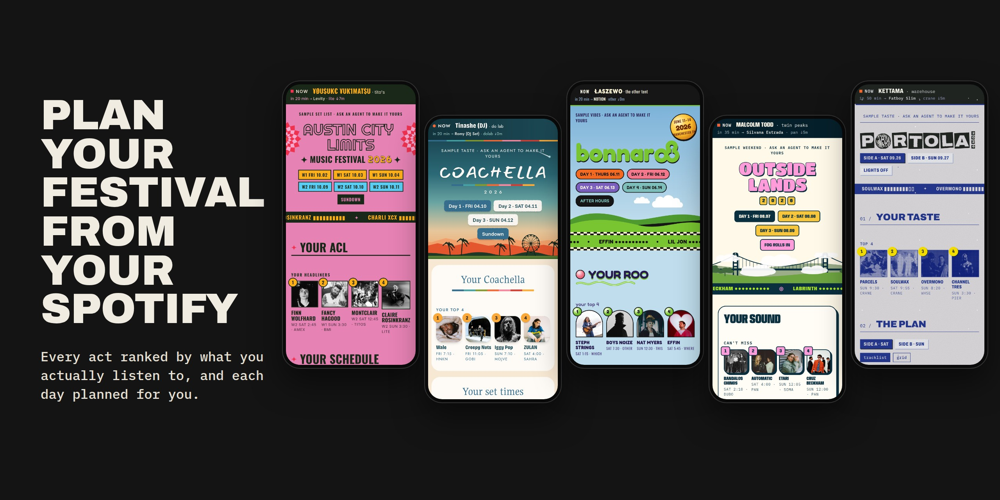

## Start

You need a Mac with Apple silicon (or Linux), and a Claude or ChatGPT plan.

1. **Get bb.** [Download it](https://getbb.app) and open it.
2. **Start a thread.** Click **New thread**. If bb says Claude Code isn't installed, click **Install Claude Code**. To use Codex instead, pick it in the thread's agent menu.
3. **Sign in to your agent once.** Open Terminal, run `claude`, and follow the sign-in (for Codex, run `codex login`).
4. **Paste this into the thread:**

   > Set up the festival planner from https://github.com/brsbl/festival-planner for **&lt;festival&gt; &lt;year&gt;**, and make it mine from my Spotify.

**Agents:** clone this repository and follow [`skills/festival-planner/SKILL.md`](skills/festival-planner/SKILL.md).

The agent checks in as it goes: with the lineup it found, with screenshots of the look, and with your ranked acts. It also asks which acts you won't miss and how to read your Spotify.

A festival already in **Examples** below is ready in a few minutes. A new one takes about an hour, mostly finding set times. When it's done, open the festival from bb's sidebar.

**More festivals:** ask *"Add &lt;festival&gt; &lt;year&gt; to my festival planner."* Each gets its own sidebar entry and its own ranking.

### Spotify

The agent reads your liked songs and what you play most (your top artists and tracks for the last month, six months, and all time) in bb's browser. Any of these works:

- **Sign in once** at open.spotify.com in a bb browser tab. This is the simplest.
- **Share public playlists** instead, if you'd rather not sign in: your own, or your Liked Songs copied into a playlist.
- **Just tell the agent** the artists you love. It ranks from that, with less to go on.

If you're already signed in to Spotify in Chrome, Arc, or Safari, the agent can copy that sign-in into bb's browser. Your Mac will ask for permission first, because those browsers lock their cookies.

Your songs and scores stay in bb's plugin storage on your machine. They're never written into the repository or sent anywhere else.

## Examples

Each of these was set up from this template by an agent following its instructions, from the festival's real set times and its own site and posters. Ask for one by name and it's copied in finished.

| Austin City Limits 2026 | Portola 2026 | Coachella 2026 | Bonnaroo 2026 | Outside Lands 2026 |
| --- | --- | --- | --- | --- |
| 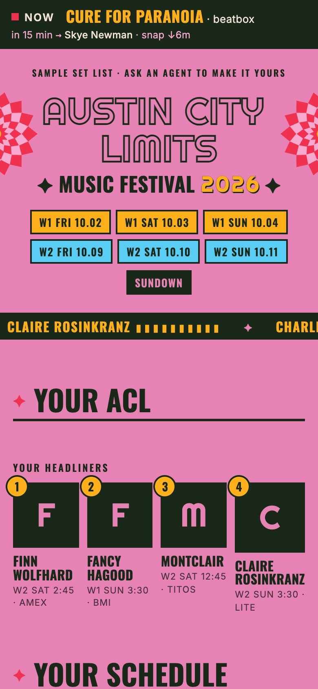 | 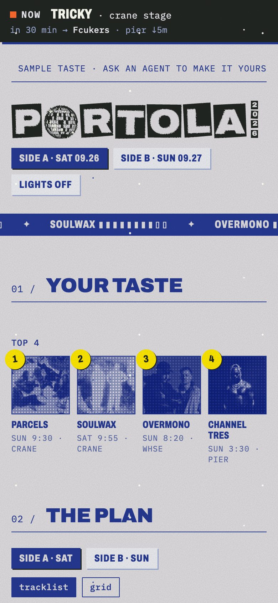 | 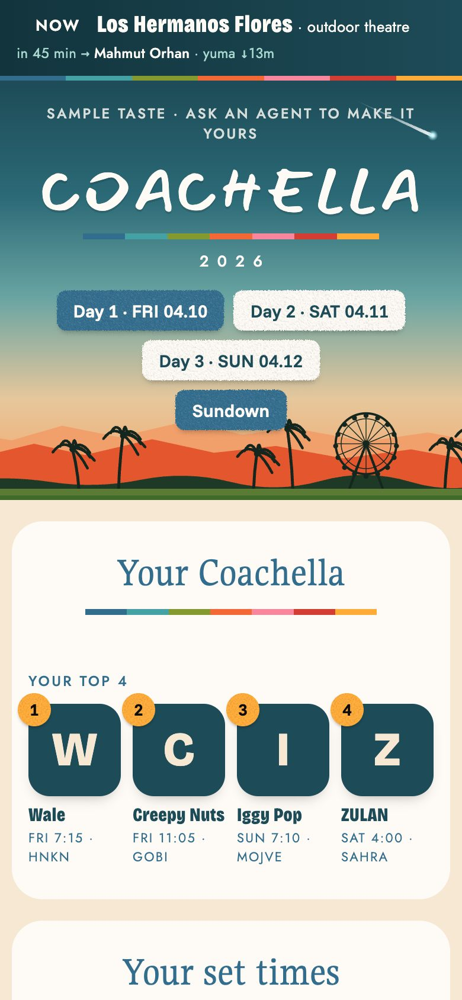 | 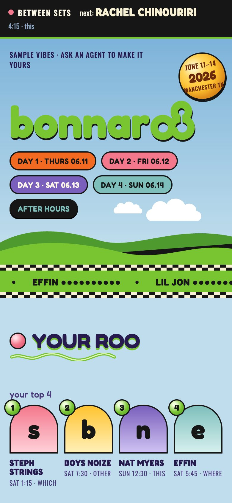 | 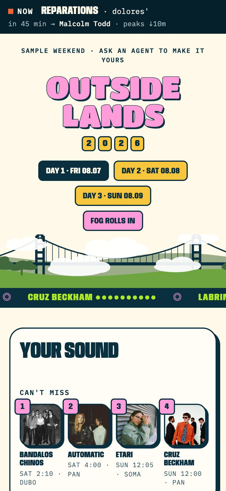 |
| 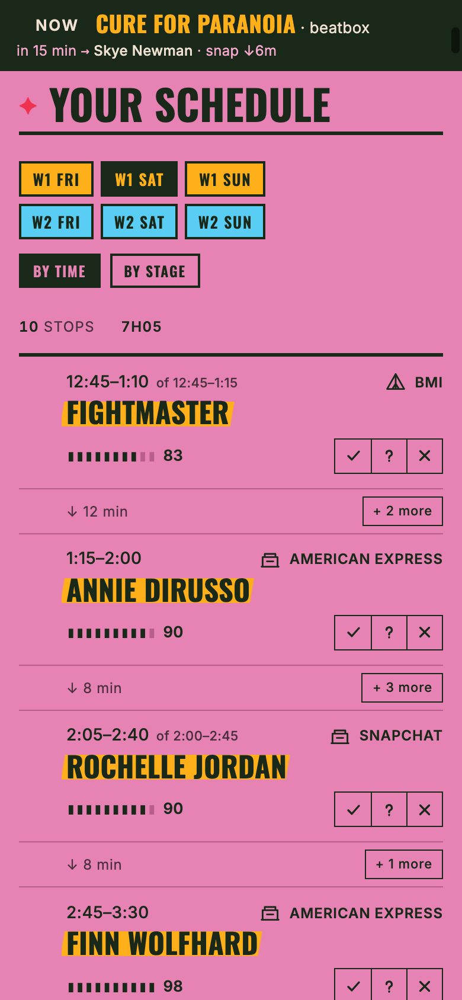 | 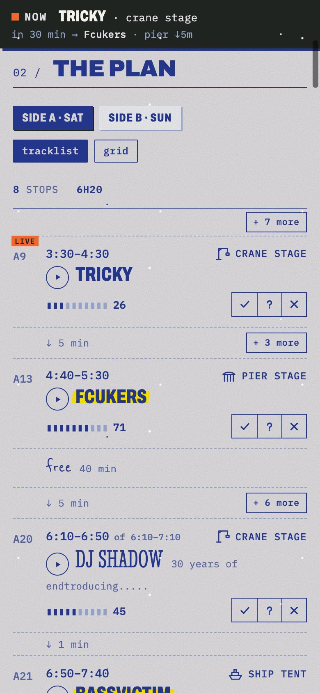 | 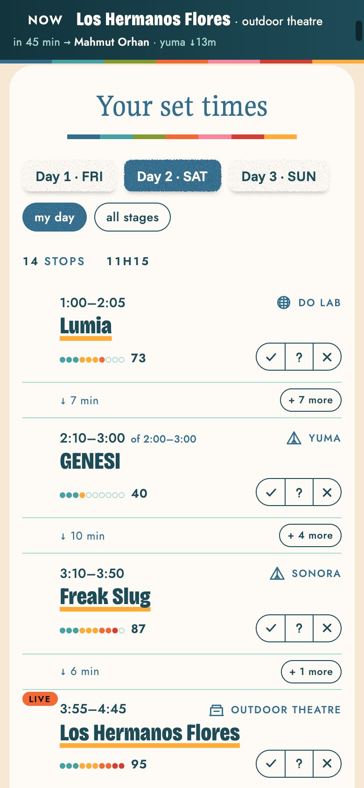 | 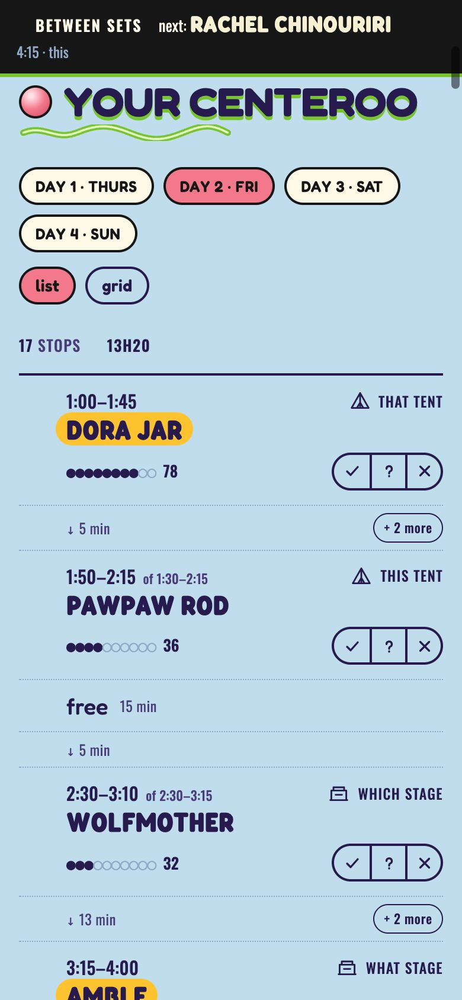 | 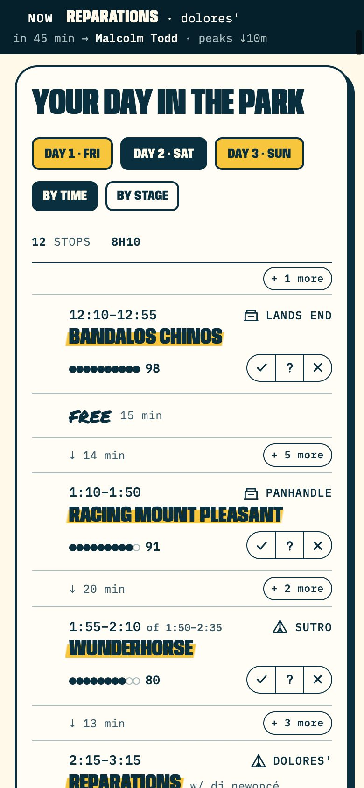 |
| 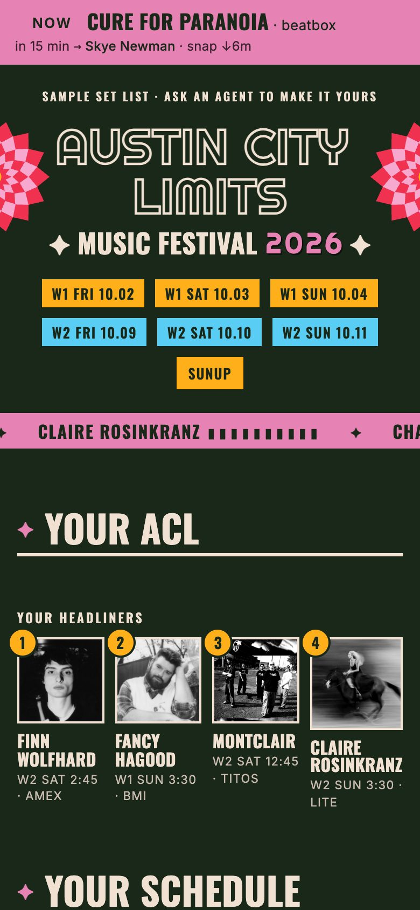 | 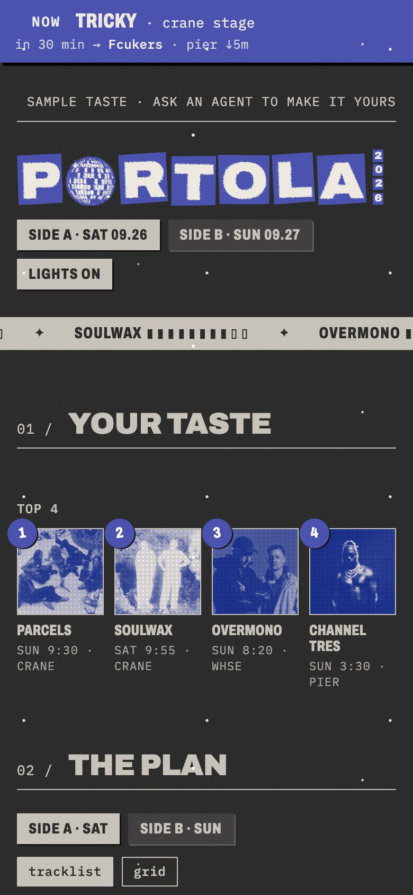 | 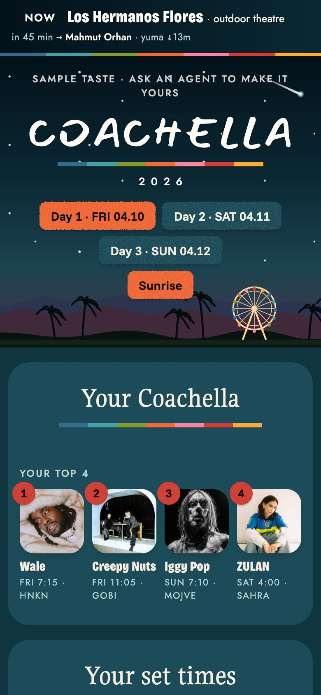 | 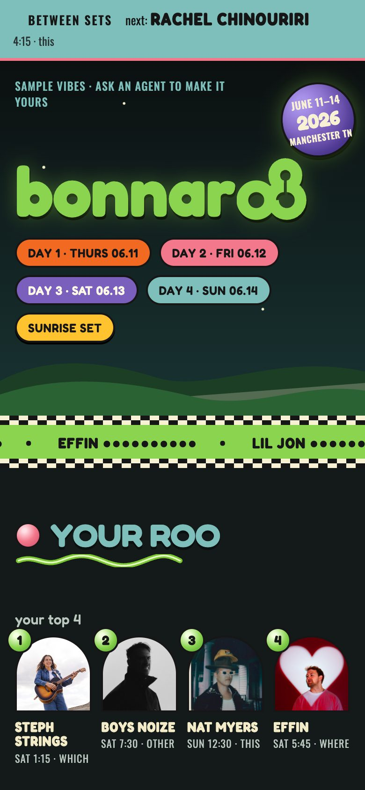 | 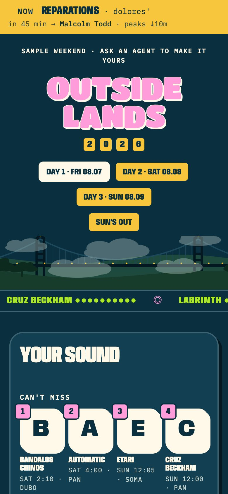 |

The screenshots use a made-up listener. These are unofficial fan planners, not affiliated with the festivals, and their set times may have changed.

## Use

- **The plan** picks a route through each day. Mark acts ✓ go, ? maybe, or ✕ skip and it replans. **+ more** between stops adds any act.
- **Overlaps** between acts you've marked go show ⇅. Swap to choose who you see first; the times follow.
- **Grid** puts every stage side by side; tap a set to cycle go, maybe, skip.
- **The catalogue** lists every act with its match, why it matched, a Spotify link, and ▶ previews.

**On your phone:** sign bb in to your bb account to turn on remote access, then open `https://<your handle>.getbb.app` on your phone and pick the festival from the sidebar. bb has to stay running on your computer.

## How it's built

`festivals/` holds the festivals you have installed, one folder each; `examples/` holds finished ones to copy. A folder has:

| File | What it holds |
| --- | --- |
| `lineup.json` | Name, dates, hours, stages, walking times, map, and every set |
| `theme.json` | Style switches, day and night colours, fonts, and wording |
| `style.css`, `assets/` | The festival's signature look |
| `icon.svg` | Its sidebar icon |
| `artists.json` | Each act's photo and Spotify link |

`skills/festival-planner/SKILL.md` is the agent's guide, and `reference.md` beside it documents every field. To add a festival by hand:

```bash
node skills/festival-planner/scripts/new-festival.mjs outside-lands-2026   # copies the example, or starts a blank folder
node skills/festival-planner/scripts/build-lineup.mjs festivals/outside-lands-2026/lineup.json
npm run brand                                                                # sidebar entries; checks colours and fonts
bb plugin install "path:$PWD" --yes                                          # keeps every festival's ranking
```

To keep your copy on GitHub, click **Use this template** on this repository.

### Commands

`--festival <slug>` picks a festival when you have more than one.

| Command | What it does |
| --- | --- |
| `bb festival list [--json]` | Installed festivals |
| `bb festival status [--festival <slug>] [--json]` | Each festival's folder and whose taste it's using |
| `bb festival export <lineup\|theme\|taste\|previews>` | Print what's in use |
| `bb festival import <taste\|previews> <json>` | Load a taste; `--part i/n` and `--base64` split large files |
| `bb festival reset [taste\|previews\|all]` | Clear a festival's taste |

### Develop

```bash
npm install
npm run typecheck && npm test
bb plugin install "path:$PWD" --yes
```

The page is plain HTML, CSS, and JavaScript in `public/`. `server.ts` serves it once per festival with that festival's data. `app.tsx` adds a sidebar entry for each festival in `festivals/index.json`, which `npm run brand` writes.
